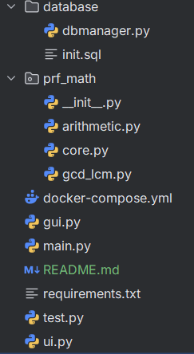

# Калькулятор НОД и НОК через примитивно рекурсивные функции

## Описание проекта

Программный комплекс для вычисления наибольшего общего делителя (НОД) и наименьшего общего кратного (НОК) с использованием примитивно рекурсивных функций (ПРФ). Проект демонстрирует практическое применение теоретических концепций теории вычислимости.

## Основные возможности

- Вычисление НОД двух чисел через алгоритм Евклида на ПРФ
- Вычисление НОК через формулу связи с НОД
- Графический интерфейс на PySide6 с визуализацией вычислений
- Консольный интерфейс для командной работы
- Сохранение истории вычислений в PostgreSQL
- Экспорт результатов в текстовые файлы
- Модульная архитектура с поддержкой тестирования

## Технологический стек

- Python 3.13
- PySide6 - графический интерфейс
- PostgreSQL - система управления базами данных
- Docker - контейнеризация БД
- pytest - фреймворк для тестирования
- SQLite - альтернативная БД для разработки

## Структура проекта

## Установка и запуск

1. Запустите базу данных:
   docker-compose up -d db

2. Установите зависимости Python:
   pip install -r requirements.txt

3. Запустите приложение:
   python main.py

## Использование

### Графический интерфейс

1. Введите два натуральных числа в поля ввода
2. Выберите операцию: НОД, НОК или обе
3. Нажмите "Вычислить" для получения результата
4. Используйте меню для дополнительных функций:
   - Сохранение в базу данных
   - Просмотр истории вычислений
   - Экспорт результатов
   - Очистка данных

## Особенности реализации

- Все функции являются примитивно рекурсивными
- Гарантированное завершение вычислений
- Визуализация процесса рекурсивных вызовов
- Поддержка больших чисел (до 1000)
- Проверка входных данных на корректность

## Математическая основа

Проект реализует:
- Базовые ПРФ: Z(x), S(x), P_i^n
- Операторы: композиция, примитивная рекурсия
- Арифметические функции: сложение, умножение, вычитание
- Алгоритм Евклида для НОД через ограниченное вычитание
- Вычисление НОК через формулу: НОК(a,b) = (a×b)/НОД(a,b)

## Тестирование

Запуск тестов:
pytest test.py -v

Тесты покрывают:
- Базовые примитивно рекурсивные функции
- Арифметические операции
- Алгоритмы НОД и НОК
- Граничные случаи и специальные значения
